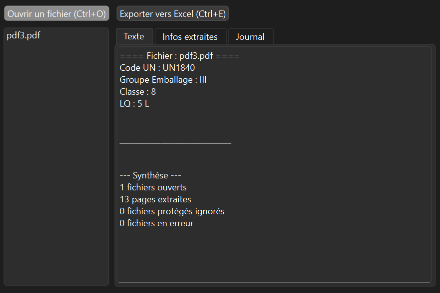
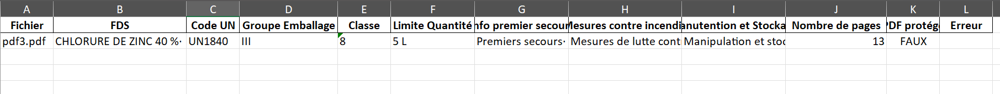

# 📋 PrevaExtract

**Solution Python de génération automatisée de tableaux Excel à partir de documents PDF hétérogènes**

---

## 🎯 Présentation

**PrevaExtract** est une application Python conçue pour **Prevarisk**, entreprise spécialisée dans l'audit et la prévention des risques professionnels.

Elle automatise l'extraction d'informations clés depuis des fichiers PDF non standardisés (fiches produits dangereux) et génère des tableaux Excel structurés, exploitables et opérationnels.

### Problématique résolue
- ❌ Extraction manuelle et chronophage d'informations dans des PDF hétérogènes
- ✅ Automatisation complète du traitement documentaire
- ✅ Génération rapide de fichiers Excel formatés et exploitables

---

## 🚀 Fonctionnalités

- **Lecture automatisée de PDF** : traitement par lot de fichiers PDF
- **Extraction intelligente** : identification et récupération des champs clés (code UN, produit, dangers, fabricant, etc.)
- **Export structuré** : génération de fichiers Excel avec une ligne par produit
- **Interface graphique intuitive** : PyQt6 pour une utilisation simple par des non-techniciens
- **Exécutables autonomes** : compilation PyInstaller pour distribution sans dépendances Python

---

## 📦 Installation

### Prérequis
- Python 3.8+
- pip

### Étapes

1. **Cloner le repository**
   ```bash
   git clone <repository-url>
   cd prevaextract1.0
   ```

2. **Créer un environnement virtuel (recommandé)**
   ```bash
   python -m venv venv
   source venv/bin/activate  # Linux/Mac
   # ou
   venv\Scripts\activate  # Windows
   ```

3. **Installer les dépendances**
   ```bash
   pip install -r requirements.txt
   ```

---

## 🏃 Utilisation

### Lancer l'application GUI

```bash
python main.py
```

L'interface graphique PyQt6 s'ouvrira, permettant de :
- Charger des fichiers PDF
- Lancer l'extraction
- Consulter et exporter les résultats en Excel

### Architecture du code

```
prevaextract1.0/
├── main.py                 # Point d'entrée (GUI PyQt6)
├── requirements.txt        # Dépendances
├── core/
│   ├── fds_extract.py      # Logique d'extraction PDF
│   └── pdf_manager.py      # Gestion des fichiers PDF
├── services/
│   └── excel_writer.py     # Génération fichiers Excel
├── ui/
│   └── main_window.py      # Interface graphique PyQt6
├── assets/
│   └── icon/               # Ressources (icônes, etc.)
└── build/                  # Fichiers de compilation PyInstaller
```

---

## 🔧 Développement

### Ajouter une nouvelle extraction

1. Modifier les patterns regex dans `core/fds_extract.py`
2. Tester avec un fichier PDF de test
3. Valider le résultat Excel généré

### Modifier l'interface

- Éditer `ui/main_window.py` (PyQt6)
- Relancer `main.py` pour voir les changements

### Générer un exécutable standalone

```bash
pyinstaller --onefile --windowed --name PrevaExtract main.py
```

L'exécutable sera dans `dist/PrevaExtract.exe`

---

## 📊 Exemple de sortie

**Entrée :** Fichiers PDF hétérogènes avec fiches produits  
**Sortie :** Fichier Excel structuré



---

## 📝 Documentation supplémentaire

- **Fiche projet détaillée** : [FicheProjet.md](FicheProjet.md)
